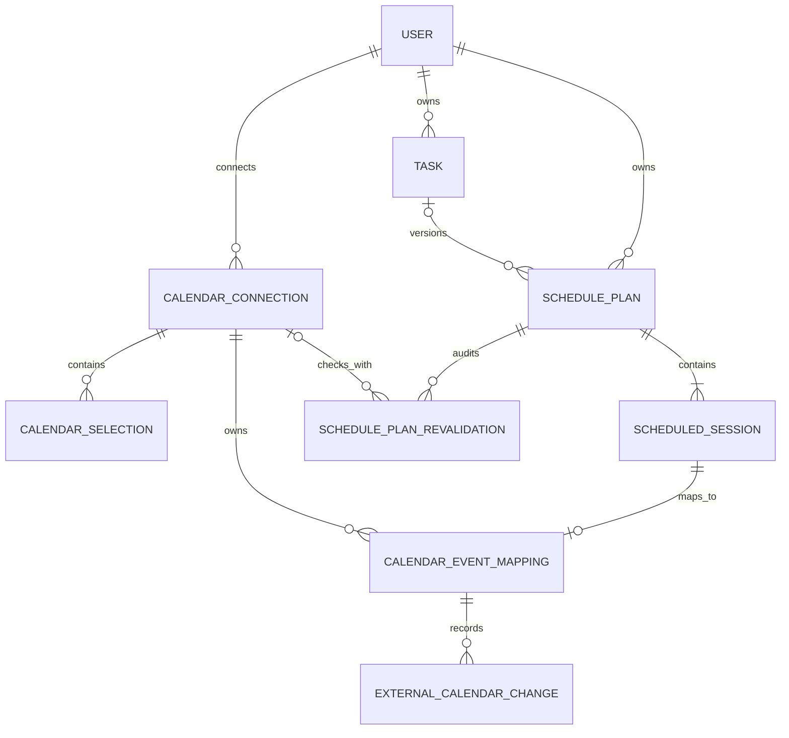

# Domain model

Last verified against code: 2026-07-28

Latest verified Alembic revision: `20260730_08`

## Overview

The model separates temporary AI interpretation, durable task intent,
provider-neutral planning, read-only calendar access, and future external event
synchronization. SQLAlchemy entities are durable unless noted otherwise;
Pydantic models are typed application contracts.



`TaskDraftV2` and `ConfirmedTask` are intentionally absent from the ER diagram
because they are not database entities.

### External Calendar Policy Engine

Purpose: transform an immutable `ExternalCalendarAggregate` and normalized
external change into typed policy decisions.

Ownership and mutability: pure domain values; aggregate, event state, sessions,
conflict details, and decisions are immutable. The engine does not accept ORM
entities or provider payloads.

Decisions: no action, update session time, extend deadline, mark event missing,
record a conflict, or flag an unsupported change. The engine identifies
outside-window, overlap, and missing-event conflicts but does not reconcile or
persist them.

Status: domain evaluation is implemented. No application service invokes or
processes its decisions yet. See
[External Calendar Policy Engine](../external-calendar-policy-engine.md).

## Entities and contracts

### User

Purpose: owns Tasks, preferences, calendar connections, and SchedulePlans.

Ownership and mutability: persistent and mutable. Email is unique; timezone is
an IANA identifier and is the scheduling timezone authority.

Relations: one user has many Tasks and SchedulePlans. Calendar connections are
unique per `(user_id, provider, provider_account_id)`.

Status: implemented.

### Task

Purpose: stores durable work intent used by database-backed preview.

Ownership and mutability: application-owned and mutable through CRUD. It is not
versioned. `TaskStatus` is `pending`, `completed`, or `cancelled`; the API can
patch status directly and does not enforce a transition graph.

Relations: belongs to User. A SchedulePlan may reference a Task through nullable
`task_id`; deleting a Task sets that reference to null.

Key invariants: positive duration, minimum session, and maximum sessions per
day; timezone-aware optional dates; earliest start before deadline; a
splittable task cannot have a minimum session longer than its duration.

Status: implemented.

### TaskDraftV2

Purpose: represents AI interpretation of natural-language input. Each
interpreted field carries value, source, confidence, explanation, and a
confirmation requirement.

Ownership and mutability: temporary application data. It is neither persisted
nor treated as confirmed user intent.

Relations: consumed with `DraftReview` by the confirmation service.

Key invariants: strict schema, versioned contract, validated provider output,
and no direct scheduler or database call.

Status: implemented.

### ConfirmedTask

Purpose: clean, provider-neutral task representation produced after typed
review.

Ownership and mutability: an immutable-style Pydantic handoff value, not a
database entity. A serialized copy is stored in
`SchedulePlan.confirmed_task_snapshot`.

Relations: mapped to deterministic scheduler input or used to create a
SchedulePlan from an existing preview.

Key invariants: no AI confidence or explanation metadata; timezone-aware date
validation; reviewed required values.

Status: implemented.

### SchedulePlan

Purpose: persists an exact provider-neutral scheduling proposal independently
of the transient preview.

Ownership and mutability: user-owned and versioned by `plan_group_id` and
`version`. Content snapshots and scheduling fields become immutable once a plan
leaves `proposed`; lifecycle and audit fields may still change according to the
transition table.

Relations: belongs to User, optionally references Task, contains ordered
ScheduledSessions, and owns revalidation audits.

Key invariants: positive version, valid planning window, unique group/version,
unique task/version, unique idempotency key, and at least one validated session
when created by the service.

Status: persistence, confirmation, obsoletion, listing, and revalidation are
implemented. Apply-related states are reserved for a future workflow.

### ScheduledSession

Purpose: represents one exact block within a SchedulePlan and is the future
synchronization unit.

Ownership and mutability: owned by its plan. Scheduling content becomes
immutable with the confirmed plan. Status can represent proposed, confirmed,
applying, applied, failed, or obsolete.

Relations: belongs to SchedulePlan, optionally references Task, and has at most
one `CalendarEventMapping`.

Key invariants: positive duration and order, start before end, stored duration
matches the interval, and order is unique within a plan.

`ScheduledSession` does not persist `external_event_id`, provider identity,
etag, or sync status. Compatibility properties read external identity through
its mapping. `CalendarEventMapping` is the sole persistence source for external
event identity and synchronization state.

Status: implemented as a plan component; external synchronization is pending.

### CalendarConnection

Purpose: stores one user's provider connection and encrypted credentials.

Ownership and mutability: user-owned and mutable as OAuth tokens refresh,
connections expire, or the user disconnects.

Relations: belongs to User and owns selections and future event mappings.

Key invariants: unique `(user_id, provider)`; provider is currently `google`;
status is `active`, `expired`, `revoked`, or `error`; tokens are encrypted and
never returned by API schemas.

Status: implemented for read-only Google access.

### CalendarSelection

Purpose: records known provider calendars and whether each contributes to
availability.

Ownership and mutability: belongs to a connection and is replaceable through
the selection endpoint.

Relations: many selections belong to one CalendarConnection.

Key invariants: external calendar identity is unique within a connection.

Status: implemented for read-only availability. A dedicated write calendar is
not yet a runtime setting.

### CalendarEventMapping

Purpose: links one ScheduledSession to one external provider event and stores
etag, provider update time, sync status, and safe diagnostics.

Ownership and mutability: application persistence mirrors provider identity and
sync observations. It is mutable by future apply and reconciliation workflows.

Relations: belongs to ScheduledSession and CalendarConnection; owns external
change audit rows.

Key invariants: one mapping per ScheduledSession and unique external identity
within `(calendar_connection_id, calendar_id, external_event_id)`.

One Task may eventually have sessions mapped to different accounts and
calendars because targets are per session. Multiple Google accounts can be
connected, but multi-account Google writing is not yet operational.

Status: model and migration implemented; no runtime creator or reconciler.

### ExternalCalendarChange

Purpose: records a detected external `created`, `updated`, `moved`, or `deleted`
change with optional before/after values and raw diagnostic payload.

Ownership and mutability: append-oriented audit data with nullable
`processed_at`.

Relations: belongs to CalendarEventMapping.

Key invariants: mapping reference and change type are required; deletion of the
mapping cascades to its changes.

Status: model and migration implemented; no detector or processor.

### SchedulePlanRevalidation

Purpose: persists each fresh read-only readiness check, its session hash,
provider outcome, conflicts, diagnostics, and validity window.

Ownership and mutability: append-oriented audit owned by SchedulePlan. An
optional request ID makes retries idempotent per plan.

Relations: belongs to SchedulePlan and User; optionally references the calendar
connection, which becomes null if disconnected.

Key invariants: captures the plan version, update timestamp, and sessions hash
used for the check. Stale concurrent results are rejected before persistence.

Status: implemented.

## Reservation invariants

Plans in `confirmed`, `revalidation_required`, `applying`, `applied`, and
`partially_applied` reserve their session intervals. Plans in `proposed`,
`failed`, and `obsolete` do not. Overlap uses half-open semantics:

```text
[start, end)
session.start < query.end AND query.start < session.end
```

An interval ending exactly when another begins is not an overlap.
