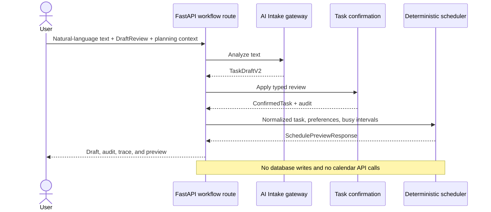
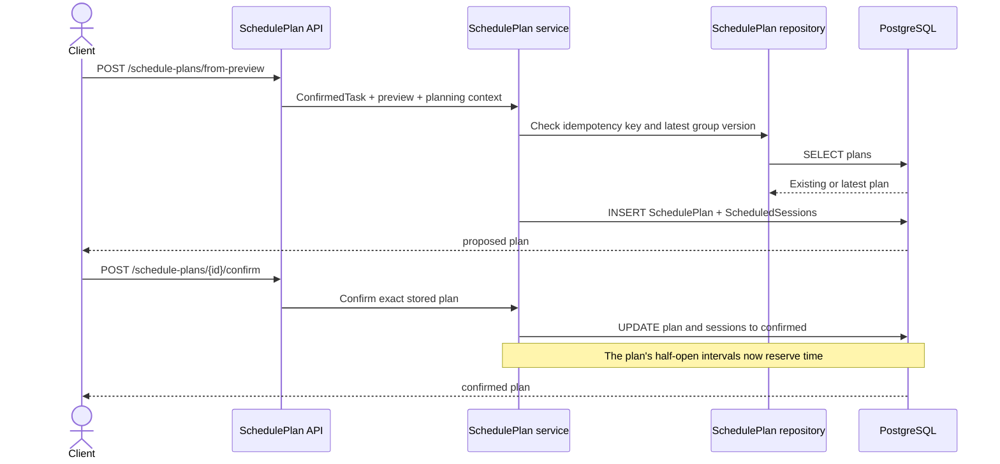
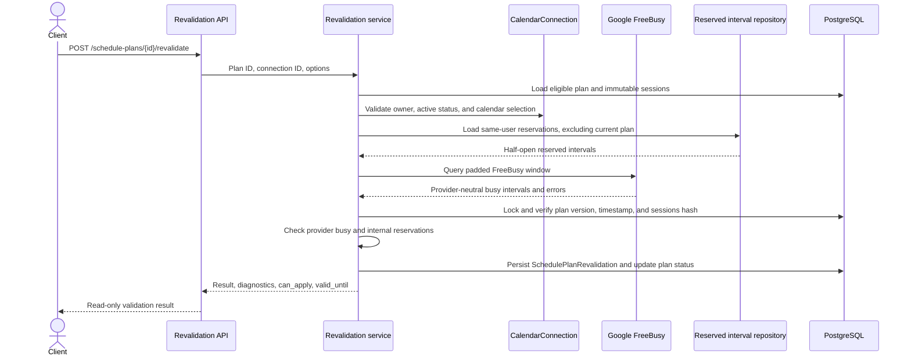

# Sequence diagrams

Last verified against code: 2026-08-02

Latest verified Alembic revision: `20260731_10`

## Task intake and scheduling preview

This internal composed flow is implemented and remains stateless.



The public `/api/v1/scheduling/preview` flow skips AI and confirmation: it loads
pending Tasks and effective preferences from PostgreSQL, combines them with
temporary request busy intervals and the user's reserved SchedulePlan
intervals, and calls the same deterministic scheduling orchestration.

## Backlog retry scheduling preview

This is an explicit, user-triggered preview for one active or deferred entry.

```mermaid
sequenceDiagram
    actor User
    participant API as Backlog API
    participant Backlog as Backlog service
    participant Reserve as Reservation policy
    participant Scheduler as Deterministic preview service
    database DB as PostgreSQL

    User->>API: POST /backlog/{id}/schedule-preview
    API->>Backlog: Entry, user, window, busy intervals
    Backlog->>DB: Lock owned entry; load Task and sessions
    Backlog->>Reserve: Calculate remaining duration and reserved intervals
    Reserve-->>Backlog: Remaining minutes and half-open reservations
    Backlog->>Scheduler: Temporary Task with remaining duration
    Scheduler-->>Backlog: Scheduled or unscheduled preview
    Backlog->>DB: Increment attempt count and timestamp only
    Backlog-->>User: Preview plus backlog metadata
    Note over Backlog,DB: No SchedulePlan, status transition, or background retry
    Note over API,Scheduler: No Google read or write in the existing preview flow
```

## SchedulePlan creation and confirmation

This flow is implemented through separate internal endpoints.



Reservation is defined by the repository query and plan status. Confirmation
does not call that query, create a separate reservation row, or write Google
events.

## SchedulePlan revalidation

All calls in this sequence are implemented.



## ApplySchedulePlan

This is a synchronous, explicit internal flow through
`POST /internal/api/schedule-plans/{plan_id}/apply`.

```mermaid
sequenceDiagram
    actor Client
    participant API as Apply endpoint
    participant Apply as ApplySchedulePlan
    participant Google as Google Calendar write API
    participant DB as PostgreSQL

    Client->>API: POST /internal/api/schedule-plans/{plan_id}/apply
    API->>Apply: Apply confirmed plan
    Apply->>DB: Validate plan, revalidation, targets; claim applying
    loop Each ScheduledSession
        Apply->>Google: Create idempotent event
        Google-->>Apply: Normalized event identity and metadata
        Apply->>DB: Persist CalendarEventMapping and session result
    end
    Apply->>DB: Finalize applied, partially_applied, or failed
    Apply-->>API: Apply result
    API-->>Client: Apply result
```

Provider calls continue after individual session failures. Existing mappings
are skipped on retry.

## Pull synchronization

This is a synchronous, explicit internal flow through
`POST /internal/api/calendar-event-mappings/{mapping_id}/sync`.

```mermaid
sequenceDiagram
    actor Client
    participant API as Mapping sync endpoint
    participant App as Pull synchronization service
    participant Google as Google Calendar read API
    database DB as PostgreSQL

    Client->>API: POST /internal/api/calendar-event-mappings/{mapping_id}/sync
    API->>App: Mapping ID and user ID
    App->>DB: Validate mapping, ownership, and active connection
    App->>Google: Get mapped event
    Google-->>App: Current time, calendar, etag, or deletion
    App->>App: Normalize and compare snapshots
    App->>DB: Lock mapping, persist ExternalCalendarChange and sync metadata
    App-->>API: Pull synchronization result
    API-->>Client: Pull synchronization result
```

Pull detection does not move a user's Google event, mutate the ScheduledSession,
extend a deadline, or return a deleted session to backlog.

## External change processing

This is a synchronous, explicit internal flow through
`POST /internal/api/external-calendar-changes/{change_id}/process`.

```mermaid
sequenceDiagram
    actor Client
    participant API as Process endpoint
    participant Process as ProcessExternalCalendarChangeService
    participant Policy as External Calendar Policy Engine
    database DB as PostgreSQL

    Client->>API: POST /internal/api/external-calendar-changes/{change_id}/process
    API->>Process: Change ID and user ID
    Process->>DB: Lock change; load owned mapping, session, plan, and Task
    Process->>Process: Construct normalized aggregate
    Process->>Policy: Evaluate aggregate and normalized change exactly once
    Policy-->>Process: Typed decisions
    Process->>Process: Validate supported decisions and targets
    Process->>DB: Atomically update session, deadline history, findings, and processed status
    Process-->>API: Stored deterministic result
    API-->>Client: Processing result
```

The processor makes no Google call, invokes no scheduler, and neither resolves
conflicts nor moves deleted work to backlog. Polling and webhooks are planned
future triggers for pull synchronization; they are not implemented flows.
