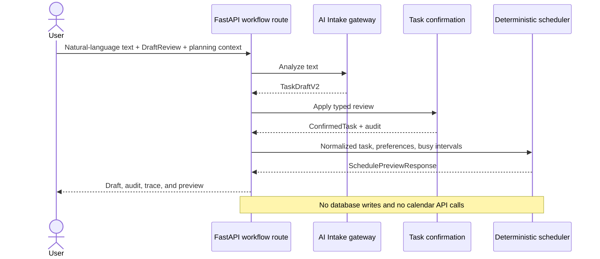
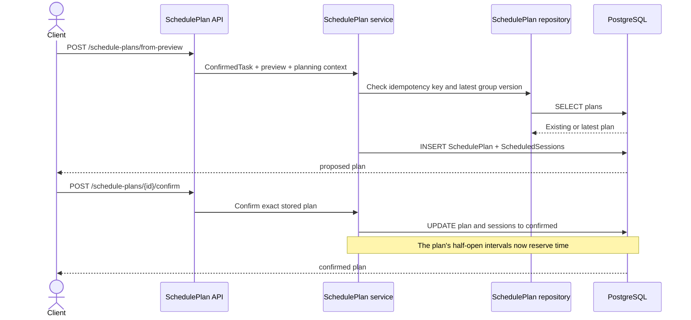
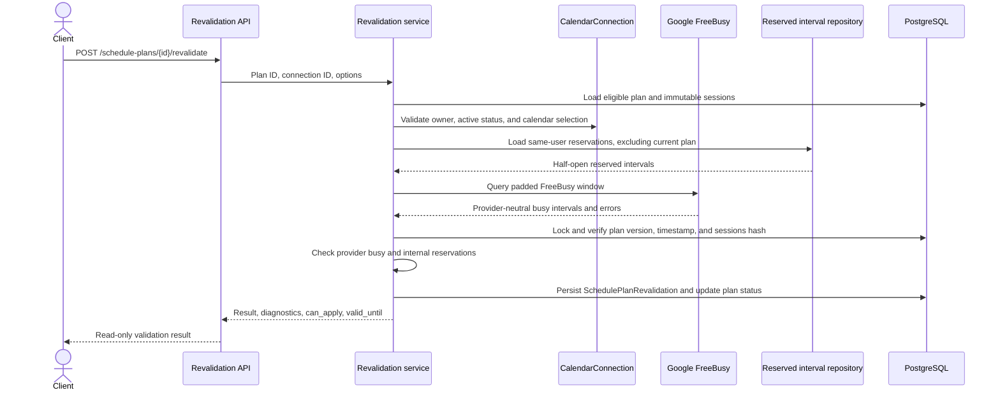
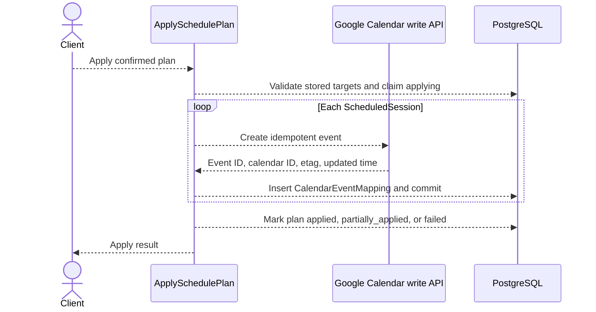

# Sequence diagrams

Last verified against code: 2026-07-28

Latest verified Alembic revision: `20260728_07`

## Task intake and scheduling preview

This internal composed flow is implemented and remains stateless.



The public `/api/v1/scheduling/preview` flow skips AI and confirmation: it loads
pending Tasks and effective preferences from PostgreSQL, combines them with
temporary request busy intervals and the user's reserved SchedulePlan
intervals, and calls the same deterministic scheduling orchestration.

## SchedulePlan creation and confirmation

This flow is implemented through separate internal endpoints.



Reservation is defined by the repository query and plan status. Confirmation
does not call that query, create a separate reservation row, or write Google
events.

## SchedulePlan revalidation

All calls in this sequence are implemented.



## ApplySchedulePlan



Provider calls continue after individual session failures. Existing mappings
are skipped on retry.

## Pull reconciliation — planned

```mermaid
sequenceDiagram
    participant App as Pull reconciliation job
    participant Google as Google Calendar read API
    database DB as PostgreSQL
    participant Checker as ConsistencyChecker

    App-->>DB: Load CalendarEventMappings
    App-->>Google: Read mapped external events
    Google-->>App: Current time, calendar, etag, or deletion
    App-->>DB: Compare mapping and record ExternalCalendarChange
    App-->>Checker: Check all non-deleted task sessions
    Checker-->>App: ConsistencyResult
    App-->>DB: Update mapping/local synchronization state
    Note over App,DB: Deadline policy may extend Task deadline after a move
```

Every arrow is planned. Reconciliation must not automatically move a user's
Google event back or return a deleted session to backlog.
