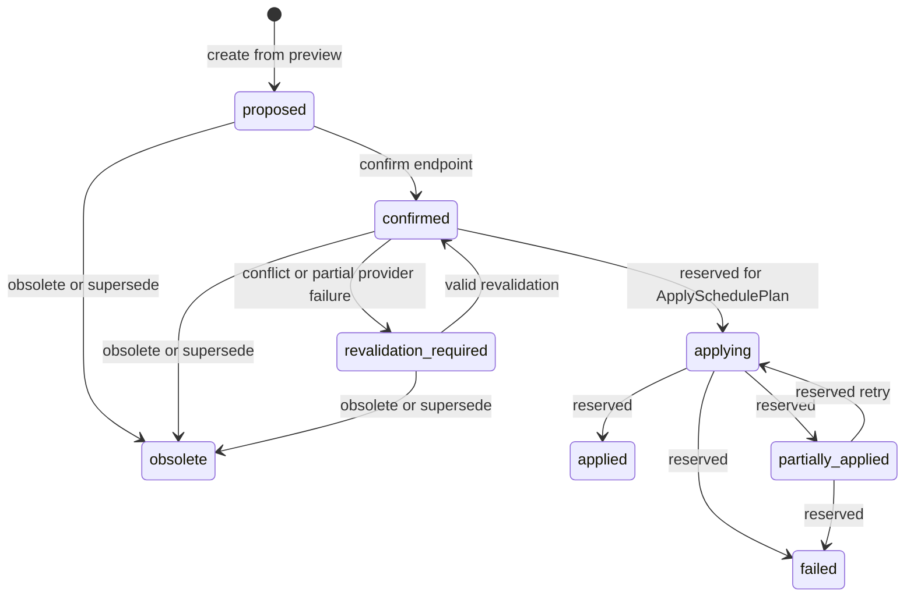
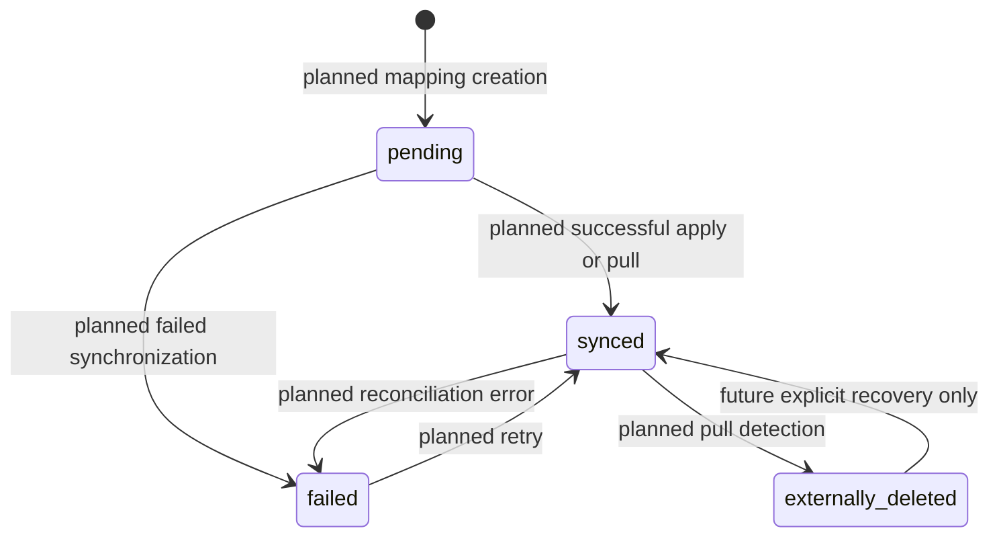
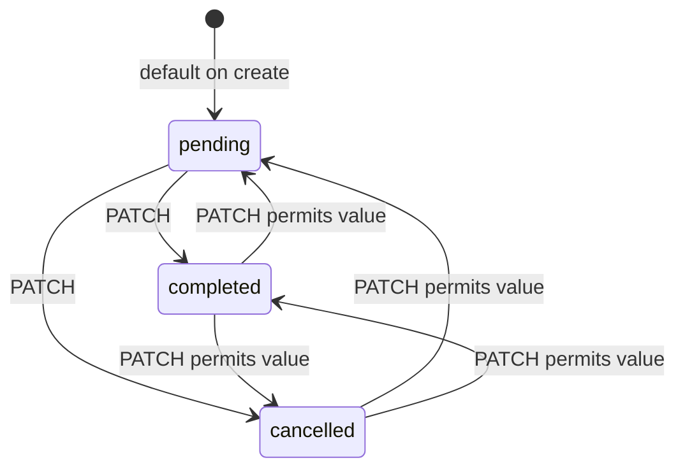
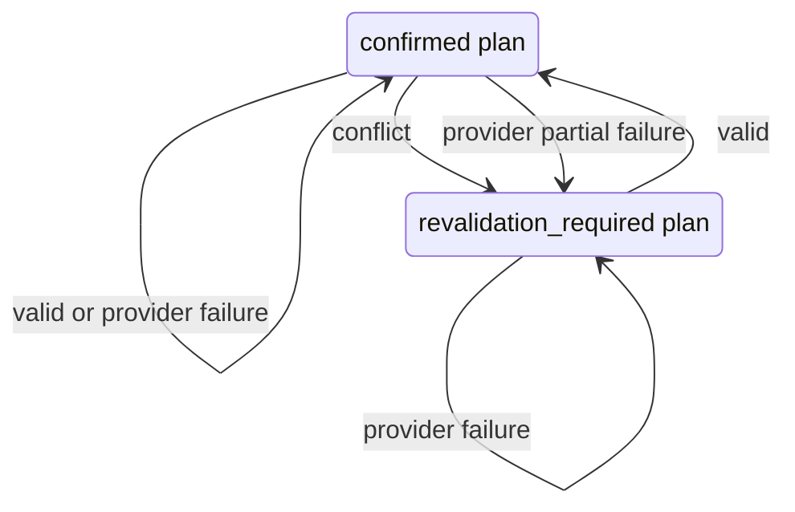

# State models

Last verified against code: 2026-07-28

Latest verified Alembic revision: `20260728_07`

## SchedulePlan lifecycle

`SchedulePlanStatus` contains `proposed`, `confirmed`, `obsolete`,
`revalidation_required`, `applying`, `applied`, `partially_applied`, and
`failed`. The service transition table allows the following graph.

Create, confirm, obsolete, supersede, and revalidation transitions have runtime
handlers. Applying-related transitions exist in the enum and transition table
but have no endpoint or application service.

Confirmation also changes all plan sessions from `proposed` to `confirmed`.
Obsoletion changes them to `obsolete`. Other `ScheduledSessionStatus` values
(`applying`, `applied`, `failed`) are reserved for apply.

Reservation follows plan status rather than session status. Confirmed,
revalidation-required, applying, applied, and partially-applied plans reserve
time.

## CalendarEventMapping synchronization lifecycle

`SyncStatus` is implemented as a database enum, but no runtime workflow
currently creates mappings or changes their status.

Only the enum values—`pending`, `synced`, `failed`, and
`externally_deleted`—are implemented today. Every arrow in this diagram is a
planned runtime transition, not current behavior.

## Task lifecycle

`TaskStatus` contains `pending`, `completed`, and `cancelled`.

There is no dedicated Task transition policy. The update schema accepts a valid
enum value and the CRUD service applies it, so the API technically permits any
transition among these states. Backlog is not a Task status and is not
implemented.

Only pending Tasks are loaded by database-backed scheduling preview.

## Revalidation lifecycle

`SchedulePlanRevalidationStatus` contains `pending`, `valid`, `conflict`,
`provider_partial_failure`, `provider_failure`, and `invalid_plan_state`.
The current service persists `valid`, `conflict`,
`provider_partial_failure`, or `provider_failure`. It does not currently
persist `pending` or `invalid_plan_state`.

A provider failure preserves plan status and produces no valid-until time. A
partial provider failure cannot produce `can_apply=true`. Conflicts use
half-open direct-overlap semantics and separately detect minimum-break
violations. Revalidation never reschedules.

With `include_internal_busy=true`, revalidation checks reservations from other
active plans belonging to the same user. It excludes the current plan, so a plan
does not conflict with its own sessions. Provider failure still preserves the
current plan status.
