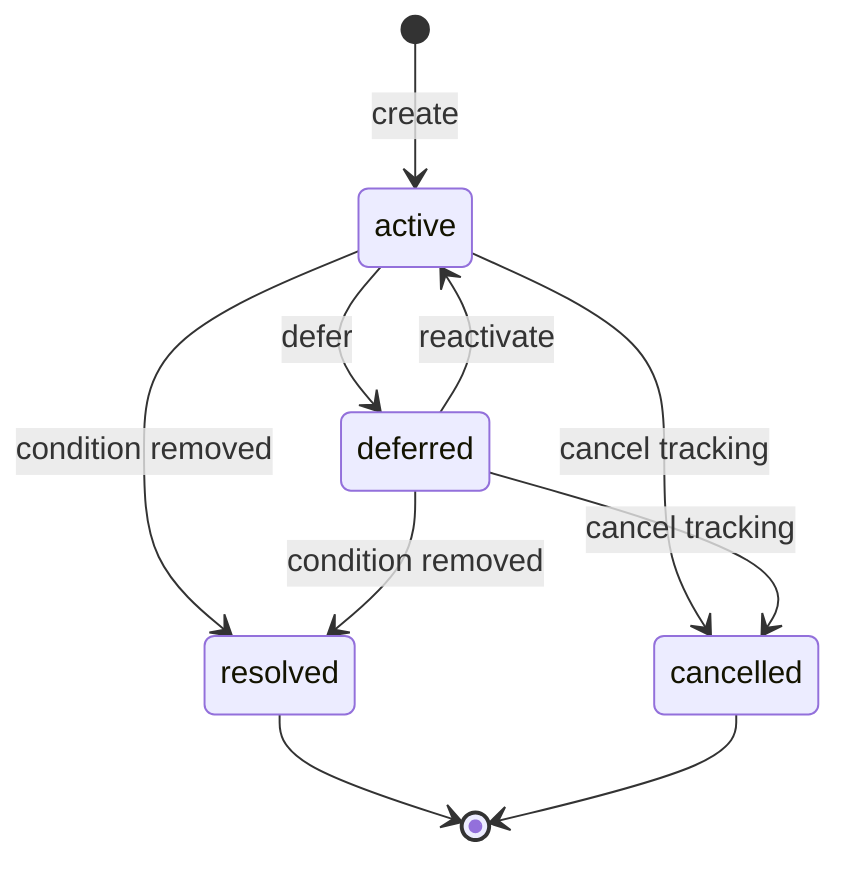
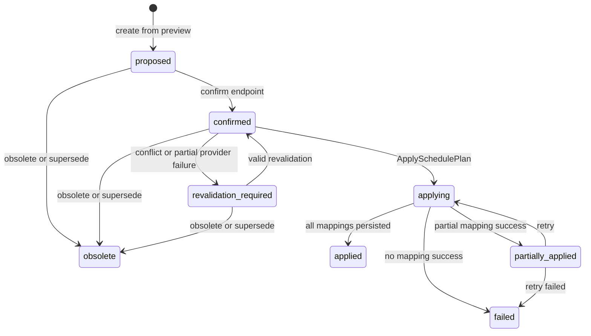
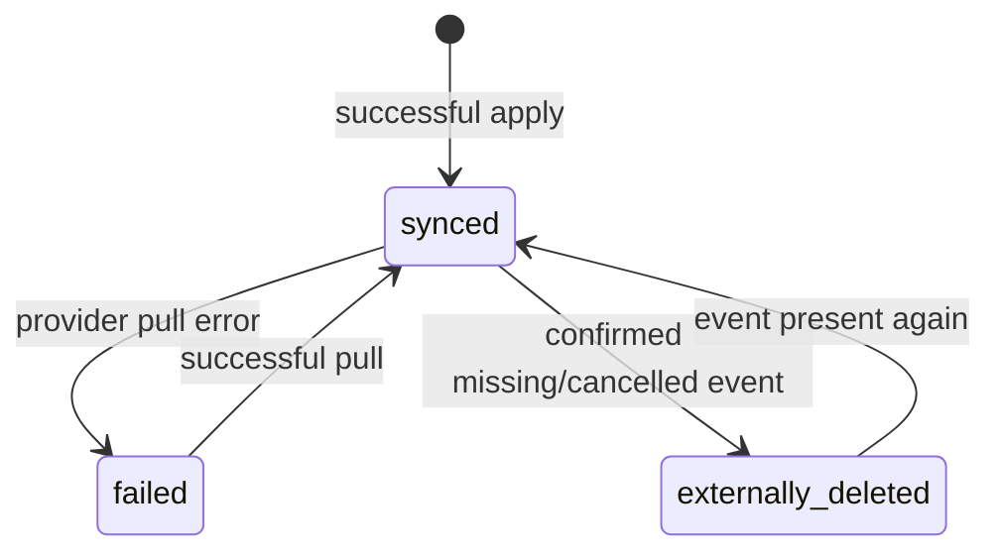
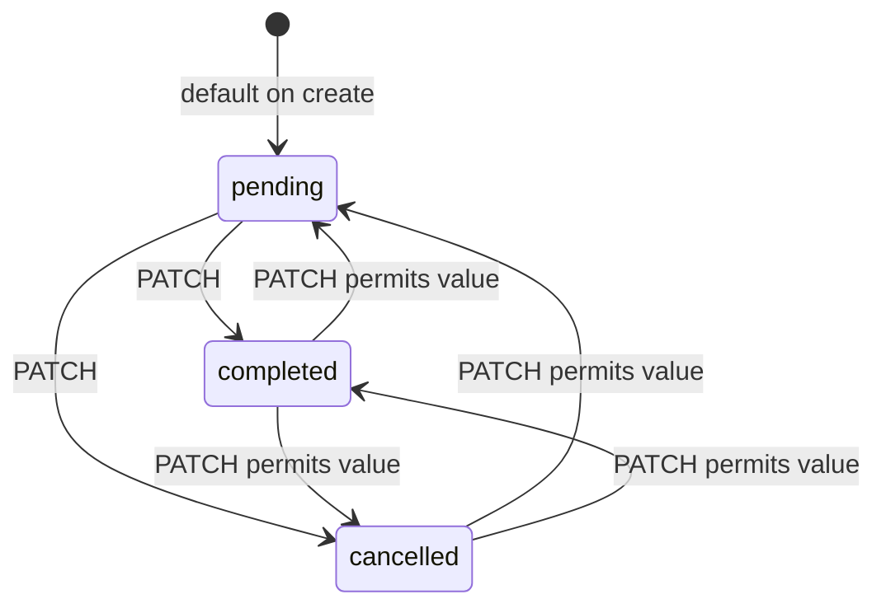
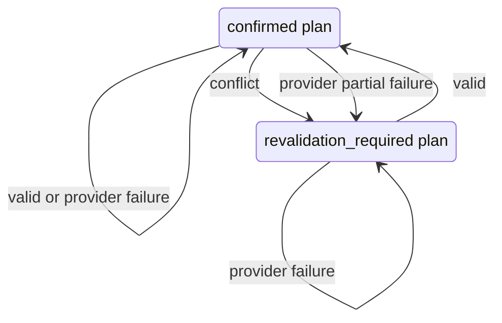

# State models

Last verified against code: 2026-08-02

Latest verified Alembic revision: `20260802_11`

## BacklogEntry lifecycle

Backlog is a separate lifecycle from `TaskStatus.pending`. An entry represents
only the currently unscheduled remainder of a Task.

Every entry records an explicit origin (`user`, `scheduler`, `system`, or
`calendar_sync`) separately from its reason. `other` requires a non-blank
explanatory note. Temporary calendar access failures remain integration errors,
not backlog reasons.

`resolved` and `cancelled` are terminal for an individual entry. If the Task
later needs backlog again, the service creates a new entry and preserves the
historical one. A partial unique index permits only one `active` or `deferred`
entry per Task. Lifecycle transitions lock the entry row; creation first locks
the owning Task row so concurrent equivalent requests return the same entry.

No transition calls the scheduler. Review timestamps support a deterministic
due-for-review query only; no polling, worker, reminder, or automatic review is
implemented. External Google event deletion does not trigger this lifecycle.
Remaining-duration calculation shares the SchedulePlan reservation policy used
by scheduling preview and revalidation.

## SchedulePlan lifecycle

`SchedulePlanStatus` contains `proposed`, `confirmed`, `obsolete`,
`revalidation_required`, `applying`, `applied`, `partially_applied`, and
`failed`. The service transition table allows the following graph.

All shown transitions have runtime handlers.

Confirmation also changes all plan sessions from `proposed` to `confirmed`.
Obsoletion changes them to `obsolete`. Other `ScheduledSessionStatus` values
(`applying`, `applied`, `failed`) are driven by Apply.

Reservation follows plan status rather than session status. Confirmed,
revalidation-required, applying, applied, and partially-applied plans reserve
time.

## CalendarEventMapping synchronization lifecycle

Apply creates mappings and pull synchronization changes their status.

The enum values remain `pending`, `synced`, `failed`, and
`externally_deleted`; pull does not process the associated external change.

## Task lifecycle

`TaskStatus` contains `pending`, `completed`, and `cancelled`.

There is no dedicated Task transition policy. The update schema accepts a valid
enum value and the CRUD service applies it, so the API technically permits any
transition among these states. Backlog is not a Task status and is not
implemented as a Task state. Backlog is implemented as a separate entity.

Only pending Tasks are loaded by database-backed scheduling preview.

## Revalidation lifecycle

`SchedulePlanRevalidationStatus` contains `pending`, `valid`, `conflict`,
`provider_partial_failure`, `provider_failure`, and `invalid_plan_state`.
The current service persists `valid`, `conflict`,
`provider_partial_failure`, or `provider_failure`. It does not currently
persist `pending` or `invalid_plan_state`.

A provider failure preserves plan status and produces no valid-until time. A
partial provider failure cannot produce `can_apply=true`. Conflicts use
half-open direct-overlap semantics and separately detect minimum-break
violations. Revalidation never reschedules.

With `include_internal_busy=true`, revalidation checks reservations from other
active plans belonging to the same user. It excludes the current plan, so a plan
does not conflict with its own sessions. Provider failure still preserves the
current plan status.
