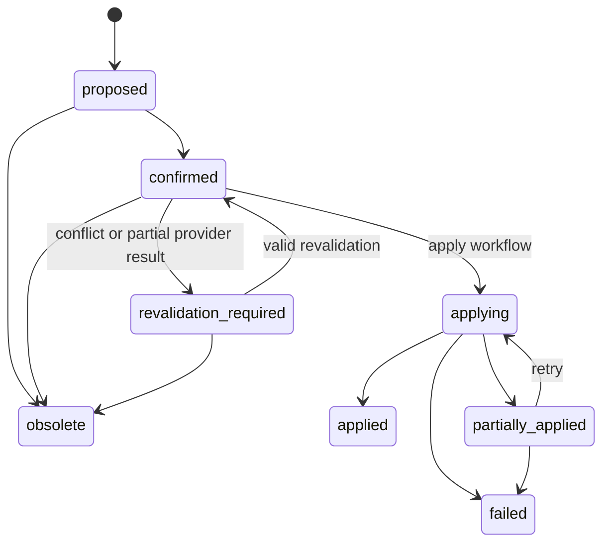

# System overview

Status: current architecture

Last verified against code: 2026-07-28

Latest verified Alembic revision: `20260730_08`

## Scope

AI Calendar currently supports the planning path from natural-language task
intent through a confirmed, persisted, and revalidated schedule plan. FastAPI
provides public Task and scheduling-preview APIs plus development-only internal
routes for AI intake, task confirmation, composed workflows, Google Calendar,
SchedulePlans, revalidation, development users, and the scheduling lab.
PostgreSQL stores users, tasks, preferences, calendar connections and
selections, SchedulePlans, sessions, revalidation audits, and the calendar
synchronization foundation.

Google Calendar access is read-only at runtime. OAuth, encrypted tokens,
calendar discovery and selection, FreeBusy, calendar-backed preview, and plan
revalidation are implemented. The application does not create or update Google
events, poll external changes, process webhooks, automatically extend task
deadlines, or return deleted sessions to a backlog.

The domain and persistence layers are ready for those later workflows:
`CalendarEventMapping`, `ExternalCalendarChange`, typed calendar-context
snapshots, deterministic context hashing, a pure consistency checker, a pure
deadline policy, and reserved-interval queries exist and are tested. No
application service currently orchestrates them into apply or pull
reconciliation.

## Main user flow

```text
Natural-language input
  → AI Intake
  → TaskDraftV2
  → user clarification and typed review
  → task confirmation
  → ConfirmedTask
  → deterministic scheduling preview
  → persisted SchedulePlan
  → plan confirmation
  → read-only SchedulePlan revalidation
  ⇢ ApplySchedulePlan (planned)
  ⇢ pull reconciliation (planned)
```

The implemented composed internal workflow,
`POST /internal/api/workflows/task-to-schedule-preview`, ends at a stateless
preview. Persistence is a separate explicit call to
`POST /internal/api/schedule-plans/from-preview`, which accepts a clean
`ConfirmedTask`, the preview, and planning context. Confirmation is another
explicit operation. This separation prevents AI output or an unreviewed preview
from silently becoming durable calendar intent.

Revalidation is available only for `confirmed` and
`revalidation_required` plans. It performs a fresh Google FreeBusy query,
combines provider busy time with reservations from the user's other active
plans, compares the exact immutable sessions, records an audit, and may move the
plan between those two states. It never reschedules a session or writes a Google
event.

## Architectural boundaries

### API layer

`app/main.py` registers the routers.

- `app/api/v1/` exposes public Task CRUD and stateless scheduling preview under
  `/api/v1`.
- `app/internal/` exposes development-only AI, confirmation, workflow,
  calendar, SchedulePlan, revalidation, development-user, scenario, and lab
  routes.
- `ENABLE_INTERNAL_TOOLS` gates internal behavior. There is no production
  authentication layer yet.

Routes validate transport schemas, translate known application errors to HTTP
responses, and delegate decisions to services. Scheduling rules do not belong
in routers.

### AI Intake

`app/ai_intake/` owns prompt selection, the provider gateway, strict structured
output validation, and `TaskDraftV2`. A draft preserves field provenance,
confidence, explanations, and confirmation requirements. It is temporary and
does not write Tasks or invoke scheduling.

### Confirmation and application workflow

`app/task_confirmation/` applies a typed `DraftReview` to a complete draft and
produces a clean `ConfirmedTask` plus an in-memory audit. It contains no
calendar or scheduler integration.

`app/workflows/task_to_schedule_preview.py` composes intake, review, deterministic
mapping, and preview generation for internal use. The word “application” here
means application-layer orchestration. `ApplySchedulePlan` separately creates
provider events from confirmed plans and persists mappings.

### Deterministic scheduler

`app/availability/` converts working hours and normalized busy intervals into
free time. `app/scheduling/` deterministically orders tasks, places blocks, and
returns reason codes, score components, warnings, and unscheduled outcomes.
Neither package calls AI, FastAPI, SQLAlchemy, or Google.

`app/services/scheduling.py` is the application orchestrator. It loads
persistent Tasks and effective preferences for database-backed preview or
accepts already normalized inputs for stateless preview.

### SchedulePlan domain

`app/schedule_plans/` persists a provider-neutral, versioned record of an exact
preview. `SchedulePlan` owns ordered `ScheduledSession` rows and immutable
snapshots of the confirmed task, preferences, busy context, and preview
diagnostics.

The implemented plan operations are create-from-preview, read, list, confirm,
obsolete, revalidate, and revalidation-history. Applying-related status values
exist to define the lifecycle but have no runtime transition endpoint or
service.

### Calendar integration

`app/calendar_integration/` defines provider-neutral contracts, safe API
models, OAuth and token handling, calendar selection, normalized busy results,
and Google adapters. The only configured scope is
`https://www.googleapis.com/auth/calendar.readonly`.

`CalendarConnection` stores encrypted access and refresh tokens and connection
health. `CalendarOAuthState` is hashed, expiring, user-bound, and single-use.
`CalendarSelection` stores which provider calendars contribute to
availability. FreeBusy intervals and event contents are not persisted.

### Persistence layer

SQLAlchemy models use UUID primary keys, timezone-aware timestamps, PostgreSQL
enums, relational constraints, and JSONB snapshots. Alembic owns schema
evolution. The current head is revision `20260730_08` in
`20260730_08_multi_account_google_connections.py`.

Repository functions in `app/schedule_plans/repository.py` load plans and query
reserved intervals. Reserving states are `confirmed`,
`revalidation_required`, `applying`, `applied`, and `partially_applied`.
Proposed, failed, and obsolete plans do not reserve time. The overlap predicate
uses half-open intervals:

```text
session.start < query.end AND query.start < session.end
```

`exclude_plan_id` prevents a plan from conflicting with itself during later
revalidation or apply orchestration.

### Synchronization domain foundation

`app/calendar_sync/` and `app/models/calendar_sync.py` provide persistence and
pure policies without provider calls:

- `CalendarEventMapping` is the only source of external event identity and sync
  state. It has a one-to-one relationship with `ScheduledSession`.
- `ExternalCalendarChange` records detected provider changes and before/after
  JSON values.
- `BusySourceSnapshot` and `SessionWriteTargetSnapshot` describe captured
  calendar context without credentials.
- `calendar_context_hash()` canonicalizes unordered input before SHA-256
  hashing.
- `DefaultConsistencyChecker` detects session overlap, minimum-break
  violations, invalid order, the latest session ending after the deadline, and
  externally deleted sessions.
- `deadline_after_external_move()` returns the maximum of the current deadline
  and all non-deleted session ends.

These are foundations only. Nothing currently creates mapping rows from Google
events, records detected external changes, invokes the consistency checker from
an endpoint, or applies the deadline result to a Task.

## Container diagram

Solid arrows are implemented runtime interactions. Dashed arrows are planned.

```mermaid
flowchart LR
    User[User]
    UI[Internal UI / API client]
    API[FastAPI]
    AI[AI Intake]
    Confirm[Confirmation workflow]
    Scheduler[Deterministic availability and scheduler]
    Plan[SchedulePlan domain]
    Revalidation[Revalidation service]
    CalendarRead[Google Calendar read integration]
    SyncDomain[Calendar synchronization domain foundation]
    DB[(PostgreSQL)]
    Google[Google Calendar]
    Apply[ApplySchedulePlan]
    PullSync[Pull reconciliation - planned]

    User --> UI
    UI --> API
    API --> AI
    AI --> Confirm
    Confirm --> Scheduler
    Scheduler --> Plan
    API --> Plan
    Plan --> Revalidation
    Revalidation --> CalendarRead
    CalendarRead --> Google
    API --> DB
    Plan --> DB
    CalendarRead --> DB
    SyncDomain --> DB

    Plan -. planned .-> Apply
    Apply -. planned .-> Google
    Google -. planned .-> PullSync
    PullSync -. planned .-> SyncDomain
```



## Main data flow

AI Intake receives only natural-language text and returns a temporary typed
draft. Confirmation combines that draft with an explicit review and returns a
temporary clean `ConfirmedTask`. The composed internal workflow maps that value
to scheduler input and returns a preview without persistence.

Database-backed preview instead loads pending Tasks and effective preferences
from PostgreSQL. It also loads the current user's reserved SchedulePlan
intervals for the planning window and merges them with temporary request busy
intervals. Both paths converge on the same deterministic availability and
scheduling core. Normalized Google FreeBusy intervals are inputs, not durable
events.

SchedulePlan creation is a separate internal request. It persists the confirmed
task snapshot, preference and busy summaries, preview diagnostics, and exact
ScheduledSessions. Confirmation changes plan and session status and makes the
plan's intervals reserving. Revalidation loads the immutable plan, calls Google
FreeBusy through the active CalendarConnection, verifies that the plan did not
change during I/O, and persists a `SchedulePlanRevalidation`.

Apply persists mappings. The remaining synchronization models and pure policies
have no runtime caller; future pull reconciliation will persist external
changes and consistency outcomes.

## Source-of-truth model

| Lifecycle stage | Source of truth | Notes |
|---|---|---|
| Before confirmation | `TaskDraftV2` plus the user's pending `DraftReview` | AI output is a proposal and is not durable task intent. |
| After `ConfirmedTask` | The clean confirmed application value | It contains reviewed task meaning without AI confidence metadata. The composed workflow remains stateless. |
| After SchedulePlan confirmation | The application database | `SchedulePlan` and immutable `ScheduledSession` blocks are the approved proposal and reserve time. No Google event exists yet. |
| After successful Google event creation | Google for actual event time, calendar placement, and existence; the application for Task metadata and planning history | Apply activates this boundary for each successfully mapped session. |

## Current limitations

- There is no Google event update or deletion.
- There is no pull reconciliation, polling loop, webhook, or push trigger.
- Reserved SchedulePlan intervals are merged into database-backed scheduling
  preview and revalidation.
- The consistency checker and deadline extension policy have no runtime caller.
- There is no automatic rescheduling after external changes.
- There is no backlog domain.
- There is no authenticated product UI; the scheduling lab is internal only.
- The database allows multiple CalendarConnections per user/provider and
  prevents duplicate external accounts for the same user.

## Domain lifecycle

### Task interpretation

```text
TaskDraftV2 (temporary)
  → DraftReview (temporary)
  → ConfirmedTask (clean application DTO)
  → optional persistent Task / SchedulePlan snapshot
```

AI confidence and explanation metadata do not leak into the confirmed task or
the deterministic scheduler input.

### SchedulePlan

Applying-related transitions are present in the domain transition table, but
Apply now drives the applying transitions:



`confirmed` means the user approved the exact stored sessions and those
intervals reserve time. It does not mean Google events exist. A successful,
fresh revalidation means the exact plan passed a read-only availability check;
it is not an apply result.

### Calendar synchronization

The persistence enums define:

- sync status: `pending`, `synced`, `failed`, `externally_deleted`;
- external change type: `created`, `updated`, `moved`, `deleted`;
- consistency status: `consistent`, `inconsistent`;
- issue codes: `session_overlap`, `minimum_break_violation`,
  `invalid_session_order`, `latest_session_after_deadline`, and
  `externally_deleted_session`.

No runtime lifecycle currently drives these values.

## API flow

Verified public routes:

- Task CRUD under `/api/v1/tasks`
- `POST /api/v1/scheduling/preview`

Verified internal route groups:

- AI intake: `/internal/api/task-drafts/analyze`
- task confirmation: `/internal/api/task-drafts/confirm`
- composed workflow: `/internal/api/workflows/task-to-schedule-preview`
- SchedulePlans: `/internal/api/schedule-plans/...`
- user plan listing: `/internal/api/users/{user_id}/schedule-plans`
- Google Calendar: `/internal/api/calendar/...`
- development users: `/internal/api/dev/users`
- scheduling lab: `/internal/scheduling-lab`

The generated, authoritative endpoint catalog is available through Swagger UI
at `/docs` and OpenAPI JSON at `/openapi.json` while the application is running.

## Near-term roadmap

1. Add pull reconciliation that reads mapped events, records
   `ExternalCalendarChange`, and invokes the pure consistency checker.
2. Apply the deadline extension policy after externally moved sessions, with
   explicit audit behavior.
3. Define backlog semantics; externally deleted sessions must not silently
   reappear.
6. Add authenticated product APIs and a basic product UI.
7. Consider push notifications only as an optional trigger after pull
   reconciliation is reliable.

Outlook, Apple Calendar, and webhooks are not committed MVP scope in the
current repository.
